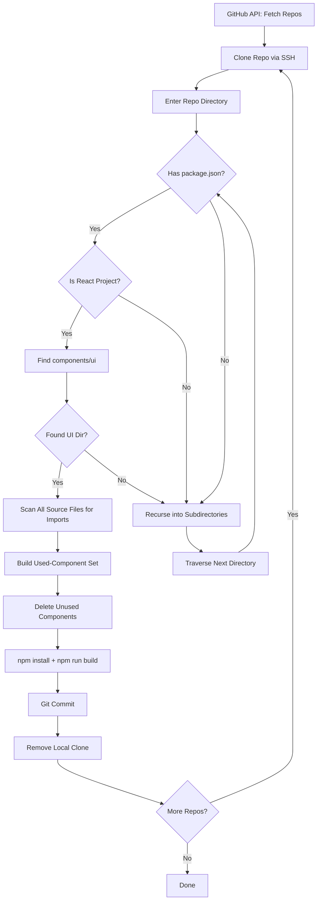

# GitHub-Cleaner-Go

**Autonomous Repository Maintenance & Dead Component Elimination Engine**

GitHub-Cleaner-Go is a production-grade automation tool that systematically traverses GitHub repositories, performs static import analysis on React codebases, identifies and removes unused UI components, validates builds post-cleanup, and commits the results — all without human intervention.

Built for developers managing large React ecosystems where component bloat accumulates across repositories. The tool functions as an autonomous maintenance agent, reducing technical debt through programmatic dead-code elimination.

---

## Architecture Summary

```
┌─────────────────────────────────────────────────────────┐
│               GitHub-Cleaner-Go Engine                    │
├───────────────┬──────────────────────┬───────────────────┤
│  Repository    │  Static Analysis     │  Build & Commit   │
│  Orchestration │  Pipeline            │  Pipeline          │
├───────────────┼──────────────────────┼───────────────────┤
│ • API Fetch   │ • Regex Import Scan  │ • npm install     │
│ • Clone       │ • Source Graph Build │ • Production Build│
│ • Traversal   │ • Dead-Component ID  │ • Git Commit      │
│ • Cleanup     │ • File Deletion      │ • Local Cleanup   │
└───────────────┴──────────────────────┴───────────────────┘
```

The system operates as a three-stage pipeline: **repository orchestration** → **static analysis & dead-component elimination** → **build verification & commit**. Each stage is sequentially dependent, forming an atomic cleanup transaction per repository.

---

## Core Features

- **Autonomous Repository Discovery** — Fetches all repositories from a GitHub account via the REST API (up to 100 repos per request)
- **Recursive Filesystem Traversal** — Walks directory trees to locate React projects with `components/ui` directory structures
- **Regex-Based Static Import Analysis** — Scans `.ts`, `.tsx`, `.js`, `.jsx` files for import statements referencing `components/ui/*` components
- **Dead Component Elimination** — Compares used components against filesystem entries; removes orphaned components
- **Build Validation** — Executes `npm install --legacy-peer-deps && npm run build` to verify post-cleanup integrity
- **Git Automation** — Automatically commits cleanup changes with standardized commit messages
- **Ephemeral Repository Lifecycle** — Clones, processes, and destroys local repository copies — leaving no residual artifacts

---

## Technical Workflow

### Stage 1: Repository Orchestration

1. **GitHub API Discovery** — Issues `GET /users/{username}/repos?per_page=100` to enumerate all repositories
2. **SSH Clone** — Clones each repository via `git@github.com:{username}/{repo}.git`
3. **Context Switch** — Changes working directory to the cloned repository root
4. **Recursive Scanner Invocation** — Initiates `DeepSearchAndClean()` on the repository root

### Stage 2: Static Analysis & Cleanup Pipeline

1. **Filesystem Enumeration** — Lists files and directories at the current level
2. **React Project Detection** — Checks for `package.json` containing both `react` and `react-dom` dependencies
3. **UI Directory Discovery** — Walks the tree to find `components/ui` directories
4. **Source Graph Analysis** — Walks every `.ts/.tsx/.js/.jsx` file, extracting import paths matching the pattern:
   - `[./@"]components/ui/([A-Za-z0-9_-]+)`
5. **Usage Mapping** — Builds a lowercase-normalized set of used component names
6. **Dead Component Elimination** — Iterates over `components/ui` entries, deleting any file whose base name (without extension) has zero import references
7. **Build Verification** — Runs the project build to confirm no regressions were introduced

### Stage 3: Commit & Cleanup

1. **Git Commit** — Stages and commits all changes with message: `auto: cleanup ui and build`
2. **Repository Destruction** — Changes directory to parent and recursively removes the cloned repository

---

## Example Execution Flow



---

## Repository Traversal Explanation

The traversal is implemented as a **depth-first recursive directory walk** (`DeepSearchAndClean`). At each node:

1. The directory is enumerated for files and subdirectories
2. If a `package.json` is present, the node is treated as a potential project root and passed to `CleanThis`
3. If no `package.json` exists, the function recurses into each subdirectory

This design allows the system to handle monorepos, nested projects, and repositories with complex directory structures. The traversal terminates at leaf directories with no further subdirectories or upon discovering a valid React project.

---

## Static Analysis Explanation

The static analysis subsystem uses **regex-based import scanning** rather than full AST parsing. The regular expression:

```
[./@"]components/ui/([A-Za-z0-9_-]+)
```

Matches import statements in the following common patterns:

| Import Pattern | Example |
|---|---|
| Relative import | `./components/ui/Button` |
| Absolute import | `@/components/ui/Card` |
| String import | `"components/ui/Modal"` |
| Named import | `components/ui/Button` |

The analysis builds a **usage frequency map** (boolean, presence-based) by lowercasing the captured component name. Files are then compared against this map — any file in `components/ui` whose stem does not appear in the usage set is considered dead and scheduled for deletion.

**Known Limitation**: Dynamic imports using template literals or computed strings are not resolved. The analysis also does not handle re-exports or barrel files.

---

## Build Validation Explanation

Post-cleanup, the system executes:

```bash
npm install --legacy-peer-deps && npm run build
```

This serves dual purposes:
1. **Integrity Check** — Verifies that no deleted component was actually required at build time (catches false positives)
2. **Dependency Resolution** — Ensures the project is in a buildable state after modifications

The `--legacy-peer-deps` flag is used to accommodate common peer dependency conflicts in React ecosystems. Build failures halt the pipeline for that specific repository but do not prevent processing of subsequent repositories.

---

## Example Console Output

```
Starting in: /tmp/cleanup/repos/my-react-app
Cleaning UI in: /tmp/cleanup/repos/my-react-app/src/components/ui
Deleting unused: /tmp/cleanup/repos/my-react-app/src/components/ui/OldButton.tsx
Deleting unused: /tmp/cleanup/repos/my-react-app/src/components/ui/DeprecatedCard.tsx
> my-react-app@1.0.0 build
> react-scripts build

Creating an optimized production build...
Successfully compiled.
[main (root-commit) auto: cleanup ui and build]
 2 files changed, 0 insertions(+), 0 deletions(-)
 delete mode 100644 src/components/ui/OldButton.tsx
 delete mode 100644 src/components/ui/DeprecatedCard.tsx
```

---

## Installation

```bash
# Clone the repository
git clone git@github.com:MishraShardendu22/GitHub-Cleaner-Go.git
cd GitHub-Cleaner-Go

# Build the binary
go build -o github-cleaner main.go Language.go

# Run
./github-cleaner
```

### Requirements

| Dependency | Version | Purpose |
|---|---|---|
| Go | 1.24.4+ | Compilation and runtime |
| Git | 2.x+ | Repository cloning and automation |
| SSH Agent | Any | Authentication for private repository access |
| curl | Any | GitHub API requests (Language module) |
| npm / Node.js | Any | React project build validation |

---

## Usage

### Cleanup Mode (Default)

```bash
go run main.go
```

Fetches repositories from the configured GitHub account, clones each one, performs dead component analysis, deletes unused files, validates builds, commits changes, and cleans up.

### Language Statistics Mode

```bash
export GITHUB_TOKEN=your_github_token
go run Language.go
```

Aggregates language usage statistics across all non-fork repositories and displays percentage breakdowns.

---

## Project Structure

```
GitHub-Cleaner-Go/
├── main.go          # Core cleanup engine & repository orchestration
├── Language.go      # Language statistics aggregation module
├── go.mod           # Go module definition
├── README.md        # This file
├── output.log       # Runtime execution log
├── CONTRIBUTING.md  # Contributor guidelines
├── SECURITY.md      # Security considerations
├── .gitignore       # Git exclusion rules
└── docs/
    ├── architecture.md       # System architecture documentation
    ├── how-it-works.md       # Detailed operational explanation
    ├── cleanup-engine.md     # Cleanup pipeline specification
    ├── repository-scanner.md # Scanner implementation details
    ├── build-validation.md   # Build verification methodology
    ├── security.md           # Security model & risks
    ├── limitations.md        # Known limitations
    └── roadmap.md            # Future development plans
```

---

## Technical Limitations

- **Regex-based analysis** — Cannot resolve dynamic imports, computed paths, or re-exports. May produce false negatives for obfuscated import patterns.
- **React-only scope** — Currently limited to React projects with `components/ui` structures. No support for Vue, Angular, or other frameworks.
- **SSH-only authentication** — Requires configured SSH keys for repository cloning. No HTTPS fallback.
- **Single-user mode** — Hardcoded to a single GitHub username. No multi-account or organization support.
- **No dry-run mode** — Operations are destructive by design. No preview capability for what would be deleted.
- **Hardcoded commit messages** — Git commit messages are static strings without contextual information about what was removed.

---

## Safety Warnings

> **⚠️ Destructive Operations**
> This tool deletes files and makes Git commits automatically. It is strongly recommended to:
> - Test on a fork or backup repository first
> - Review the codebase to understand deletion criteria
> - Ensure all important work is committed and pushed before running
> - Use a feature branch if possible (modify the commit step to push to a branch)

---

## Future Roadmap

See [docs/roadmap.md](docs/roadmap.md) for the complete development roadmap, including:

- AST-based parsing for 100% accurate import resolution
- AI-assisted cleanup decisioning
- Automated pull request generation
- GitHub Actions CI/CD integration
- Web dashboard for operation monitoring
- Multi-language framework support
- Distributed scanning architecture

---

## Contributing

See [CONTRIBUTING.md](CONTRIBUTING.md) for detailed contributor guidelines, including setup instructions, code style expectations, and pull request process.

---

## License

This project is licensed under the **MIT License**. See the LICENSE file for details.

The MIT License was chosen for this project because:
- It permits commercial and private use without restrictions
- It allows other developers to integrate the cleanup engine into their own tooling
- It is the most widely understood and accepted license in the open-source ecosystem
- It imposes no copyleft obligations, which is appropriate for an automation tool that may be embedded into CI/CD pipelines
- It provides appropriate disclaimer of liability (critical for a tool that performs destructive filesystem operations)

---

## Author

**MishraShardendu22**

- GitHub: [@MishraShardendu22](https://github.com/MishraShardendu22)
- Project: [GitHub-Cleaner-Go](https://github.com/MishraShardendu22/GitHub-Cleaner-Go)

---

## Related Links

- [Go Programming Language](https://go.dev/)
- [GitHub REST API Documentation](https://docs.github.com/en/rest)
- [React Documentation](https://react.dev/)


