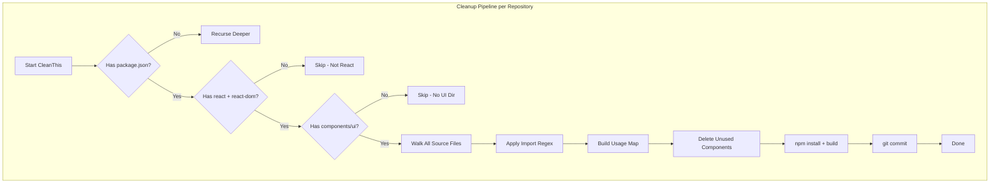
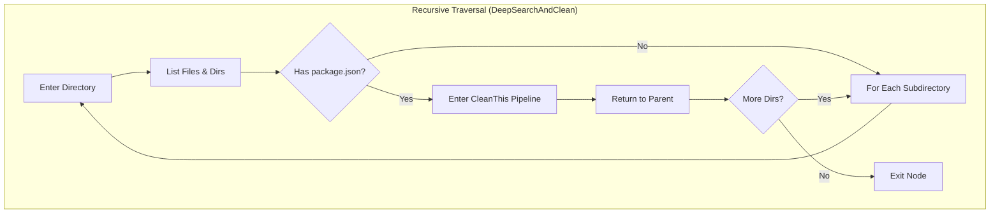

# How It Works

## Operational Model

GitHub-Cleaner-Go operates as an **autonomous repository maintenance agent**. Unlike interactive cleanup tools that require manual input per operation, this engine processes repositories in batch, making independent decisions about dead component elimination based on static analysis of the source graph.

The system does not maintain state between executions. Each run is an atomic operation that:

1. Discovers repositories from GitHub
2. Processes each repository independently
3. Destroys all local state upon completion

## Cleanup Pipeline (Detailed)

### Phase 1: Repository Enumeration

```
GET https://api.github.com/users/{username}/repos?per_page=100
       │
       ▼
Response: [{ name: "repo-1" }, { name: "repo-2" }, ...]
       │
       ▼
Extracted: ["repo-1", "repo-2", ...]
```

The GitHub API is queried without authentication. This imposes a rate limit of 60 requests per hour for unauthenticated requests. Each execution consumes 1 + N requests where N is the number of repositories (if using Language.go).

### Phase 2: Clone & Context Switch

```
For each repo name:
  │
  ├── Construct SSH URL: git@github.com:{user}/{repo}.git
  ├── Execute: git clone {url}
  ├── os.Chdir(repo)
  ├── Run: Cleaner()
  └── Defer: os.Chdir("..") + os.RemoveAll(repo)
```

The working directory is changed to the cloned repository root. This is critical because all subsequent filesystem operations are relative to the current working directory. Deferred cleanup ensures no orphaned clones remain on disk regardless of execution path.

### Phase 3: Recursive Project Discovery

```
DeepSearchAndClean("/repo-root")
  │
  ├── List files → ["package.json", "src/", ...]
  ├── Contains(files, "package.json")?
  │   ├── Yes → CleanThis(folder) ← React project found
  │   └── No  → Recurse into each subdirectory
  │               │
  │               └── DeepSearchAndClean("/repo-root/src")
  │                     ├── List files → ["App.tsx", ...]
  │                     └── No package.json → recurse...
```

This recursion terminates at two points:
1. A directory containing `package.json` — triggers the cleanup pipeline
2. A directory with no subdirectories — leaf node, nothing to process

### Phase 4: React Detection

```
Read file: package.json
  │
  ├── strings.Contains(raw, "react")?
  │   ├── Yes → Continue
  │   └── No  → Return (not a React project)
  │
  ├── strings.Contains(raw, "react-dom")?
  │   ├── Yes → React project confirmed
  │   └── No  → Return (not a React project)
```

The detection is intentionally permissive — it performs substring matching on the raw file content rather than structured JSON parsing of `dependencies` or `devDependencies`. This means comments or package-lock remnants containing "react" could produce false positives.

### Phase 5: UI Directory Discovery

```
filepath.WalkDir(root)
  │
  └── For each directory entry:
        ├── d.IsDir()?
        ├── filepath.Base(path) == "ui"?
        └── filepath.Base(filepath.Dir(path)) == "components"?
              │
              ├── All true → Return path: /root/src/components/ui
              └── Any false → Continue walking
```

The walker scans every directory in the tree. The first (and only the first) `components/ui` match is used.

### Phase 6: Source Graph Analysis

```
For each file in root (recursive):
  │
  ├── Extension in [.ts, .tsx, .js, .jsx]?
  │   ├── Yes → Read file content
  │   └── No  → Skip
  │
  ├── Apply regex: [./@"]components/ui/([A-Za-z0-9_-]+)
  │
  └── For each match:
        └── used[strings.ToLower(match)] = true
```

The regex captures the component name after the `components/ui/` prefix. The pattern supports:

| Prefix | Example | Matches |
|---|---|---|
| `./` | `./components/ui/Button` | Relative imports |
| `@/` | `@/components/ui/Card` | Path alias imports |
| `"` | `"components/ui/Modal"` | Bare specifier imports |
| None | `components/ui/Button` | Direct references |

### Phase 7: Dead Component Elimination

```
For each entry in components/ui/:
  │
  ├── Extract name without extension: "Button.tsx" → "Button"
  ├── Lowercase: "Button" → "button"
  │
  ├── used["button"] == true?
  │   ├── No  → os.RemoveAll(entry) → DELETED
  │   └── Yes → Keep
```

Components are deleted using `os.RemoveAll`, which handles both files and directories. This means component subdirectories (e.g., `Button/index.tsx`) are also removed.

### Phase 8: Build Verification

```
exec.Command("sh", "-c", "npm install --legacy-peer-deps && npm run build")
  │
  ├── npm install → Resolves and installs dependencies
  ├── npm run build → Executes production build script
  └── Exit code is NOT checked (failures are silent)
```

Build output is piped to stdout/stderr for visibility, but build failures do not halt the pipeline or revert the deletions.

### Phase 9: Git Automation

```
exec.Command("sh", "-c", "git cm 'auto: cleanup ui and build'")
  │
  └── Assumes 'cm' is a Git alias for 'commit -am'
```

This stages all changes and commits them. The `-a` flag automatically stages all modified and deleted files. No push is performed — changes remain local.

### Phase 10: Repository Cleanup

```
defer func() {
    os.Chdir("..")        // Return to parent directory
    os.RemoveAll(repo)    // Delete cloned repository
}()
```

Executed when `Clone()` returns, regardless of success or failure of the cleanup pipeline.

## Mermaid: Complete System Workflow

```mermaid
flowchart LR
    subgraph Input
        A[GitHub Account]
    end

    subgraph Orchestration
        B[API Discovery]
        C[SSH Clone]
        D[Context Switch]
    end

    subgraph Analysis
        E[Recursive Traversal]
        F[React Detection]
        G[UI Directory Locator]
        H[Import Regex Scan]
        I[Usage Map Build]
    end

    subgraph Execution
        J[Dead Component Deletion]
        K[Build Validation]
        L[Git Commit]
    end

    subgraph Cleanup
        M[Repository Removal]
    end

    A --> B --> C --> D --> E
    E --> F --> G --> H --> I
    I --> J --> K --> L --> M
```



## Mermaid: Cleanup Pipeline



## Mermaid: Repository Traversal Flow



## Mermaid: Component Analysis Flow

```mermaid
flowchart TD
    subgraph "Import Resolution & Dead Component Detection"
        UI[components/ui/ Directory] --> LIST_UI[List All Entries]
        
        subgraph SourceScan[Source File Scan]
            SRC[Source Files .ts/.tsx/.js/.jsx] --> READ[Read Content]
            READ --> REGEX[Apply Import Regex]
            REGEX --> MATCH{Capture Component Name?}
            MATCH -->|Yes| ADD_USED[Add to Used Set]
            MATCH -->|No| NEXT_FILE[Next File]
        end

        LIST_UI --> FOR_EACH[For Each Entry]
        FOR_EACH --> STEM[Extract Stem + Lowercase]
        STEM --> CHECK_USED{In Used Set?}
        CHECK_USED -->|No| DELETE[os.RemoveAll]
        CHECK_USED -->|Yes| KEEP[Preserve File]
        DELETE --> REPORT[Log Deletion]
        KEEP --> NEXT_ENTRY[Next Entry]
        NEXT_ENTRY --> FOR_EACH
    end