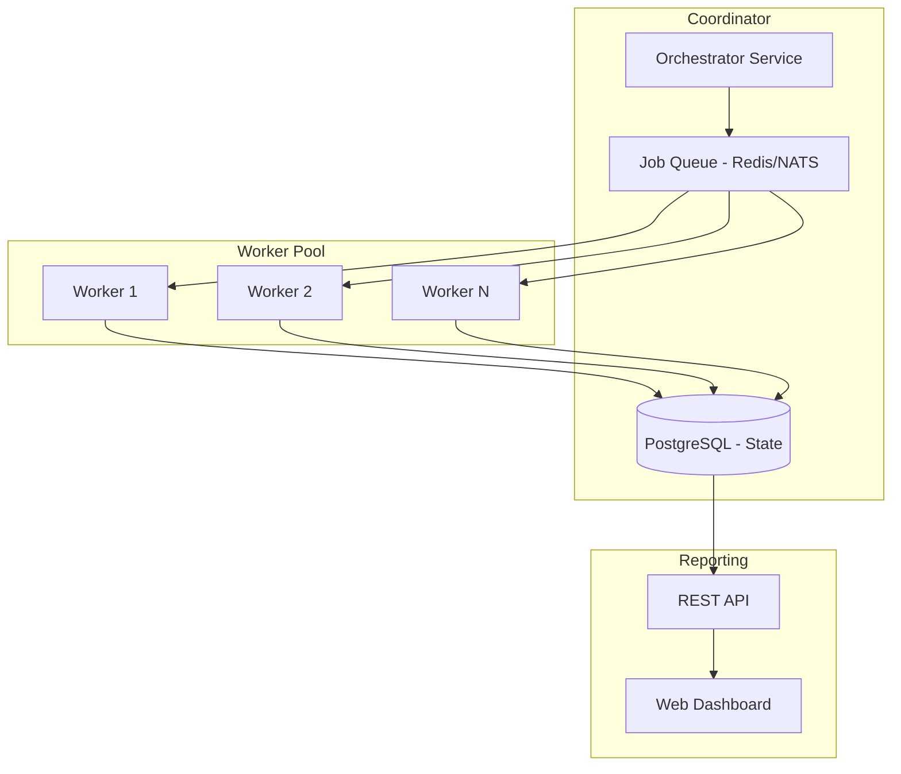

# Roadmap

## Development Vision

GitHub-Cleaner-Go is designed to evolve from a focused single-user cleanup tool into a **distributed repository intelligence engine**. The roadmap below outlines the planned trajectory across four maturity phases.

---

## Phase 1: Hardening (Current → Q1 2025)

Focus: Production readiness, safety, and reliability.

- [ ] **Dry-Run Mode** — Implement `--dry-run` flag that reports planned deletions without executing
- [ ] **Blocking Build Validation** — Check build exit code; skip commit on failure; log structured error data
- [ ] **Pre-Build Baseline** — Run build before deletions to establish a known-good state
- [ ] **Error Handling Audit** — Replace silent error handling with structured logging and graceful degradation
- [ ] **Repository Name Validation** — Sanitize repository names against `^[A-Za-z0-9_.-]+$` pattern
- [ ] **Remove Git Alias Dependency** — Use `git commit -am` directly instead of `git cm`
- [ ] **Configuration Externalization** — Move hardcoded values (username, extensions, regex, npm flags) to config file or CLI flags
- [ ] **GitHub Token Support** — Add HTTP authentication for higher API rate limits and private repository access
- [ ] **API Pagination** — Implement multi-page repository fetching for accounts with 100+ repos
- [ ] **Directory Exclusion** — Skip `.git`, `node_modules`, `.next`, `build`, `dist` during traversal

---

## Phase 2: Intelligence (Q2 2025)

Focus: Analysis accuracy, broader scope, and smarter decisioning.

### AST-Based Parsing

Replace regex-based import detection with a proper TypeScript/JavaScript AST parser:

```go
// Future: AST-based import resolution
import "github.com/smacker/go-tree-sitter/typescript"

func analyzeImports(file string) []string {
    // Parse TypeScript into CST/AST
    // Traverse ImportDeclaration nodes
    // Resolve path aliases via tsconfig.json
    // Follow re-exports through barrel files
    // Handle dynamic imports where possible
}
```

Benefits:
- 100% accurate import resolution
- Support for re-exports, barrel files, and aliases
- Dynamic import detection (limited)
- No false positives from string matches in comments

### Multi-Language Support

Extend beyond React to support additional UI frameworks:

| Framework | Directory Pattern | Analysis Method |
|---|---|---|
| React (shadcn/ui) | `components/ui/*` | Import analysis |
| Vue (shadcn-vue) | `components/ui/*` | Template + script analysis |
| Angular | `ui/*.component.ts` | Decorator analysis |
| Svelte (shadcn-svelte) | `components/ui/*` | Svelte import analysis |
| Solid.js | `components/ui/*` | JSX import analysis |

### Source Graph Analysis

Build a complete dependency graph of the project:
- Resolve all import statements across the codebase
- Identify re-export chains
- Detect circular dependencies
- Generate dependency visualization output

---

## Phase 3: Autonomy (Q3 2025)

Focus: Autonomous operation, CI/CD integration, and reduced human oversight.

### Automated Pull Requests

Instead of committing directly, create pull requests:

```go
// Future: GitHub API PR creation
func createPR(repo string, branch string, changes []string) {
    // Create feature branch: cleanup/unused-components-{timestamp}
    // Push branch to origin
    // Create PR via GitHub API with change summary
    // Add reviewers, labels, descriptions
}
```

### GitHub Actions Integration

```yaml
# .github/workflows/cleanup.yml
name: Autonomous Component Cleanup
on:
  schedule:
    - cron: '0 0 1 * *'  # Monthly
  workflow_dispatch:       # Manual trigger

jobs:
  cleanup:
    runs-on: ubuntu-latest
    steps:
      - uses: actions/checkout@v4
      - uses: actions/setup-go@v5
      - name: Run Cleanup
        run: go run main.go
        env:
          GITHUB_TOKEN: ${{ secrets.GITHUB_TOKEN }}
```

### AI-Assisted Cleanup Decisioning

Integrate with LLMs to make context-aware cleanup decisions:

```go
// Future: AI-assisted analysis
type AIDecision struct {
    Component  string
    Confidence float64
    Reasoning  string
    SuggestedAction Action
}

func analyzeWithAI(component string, contextFiles []string) AIDecision {
    // Feed component source + usage context to LLM
    // Determine if component is truly unused
    // Consider: export patterns, documentation references, test files
    // Return confidence score and suggested action
}
```

### Repository Intelligence Engine

Build a scoring system that prioritizes repositories based on cleanup potential:

| Metric | Weight | Source |
|---|---|---|
| Unused component ratio | 40% | Static analysis |
| Repository size | 15% | Git API |
| Last commit timestamp | 15% | Git API |
| Component directory size | 15% | Filesystem |
| Build success probability | 15% | Historical data |

---

## Phase 4: Scale (Q4 2025+)

Focus: Distributed architecture, web interface, and ecosystem integration.

### Distributed Scanning Architecture



### Web Dashboard

Real-time monitoring and control interface:
- Live execution feed
- Per-repository cleanup reports
- Component usage heatmap
- Rollback controls
- Schedule management
- Notification integrations (Slack, email)

### CI/CD Pipeline Integration

```mermaid
flowchart LR
    subgraph "CI Pipeline"
        PR[PR Opened] --> LINT[Lint]
        LINT --> TEST[Test]
        TEST --> BUILD[Build]
        BUILD --> CLEANUP[Cleanup Check]
        CLEANUP --> REPORT[Add PR Comment]
    end

    subgraph "Cleanup Check"
        C[Check for Unused Components]
        C -->|Found| COMMENT[Comment: "X unused components detected"]
        C -->|None| COMMENT2[Comment: "No unused components"]
    end
```

### Autonomous Documentation Updates

When components are removed:
- Update component documentation
- Remove deleted components from storybook/stories
- Update index/barrel files
- Generate changelog entries

### Advanced Cleanup Strategies

| Strategy | Description | Risk |
|---|---|---|
| Staged deletion | Remove in batches over multiple commits | Low |
| Soft delete | Move to `.trash/` directory instead of deleting | Low |
| Usage-threshold | Only delete if usage is below configurable threshold | Medium |
| A/B cleanup | Clean half of repos, compare build/bundle sizes | Low |
| Bundle analysis | Compare bundle size before/after cleanup | Low |

---

## Feature Requests

To propose features or vote on existing requests, open a [GitHub Issue](https://github.com/MishraShardendu22/GitHub-Cleaner-Go/issues).

### High Priority

1. Dry-run mode (Phase 1)
2. Configurable GitHub username (Phase 1)
3. Blocking build validation (Phase 1)

### Medium Priority

4. AST-based import parsing (Phase 2)
5. Multi-framework support (Phase 2)
6. GitHub Actions integration (Phase 3)

### Low Priority

7. Web dashboard (Phase 4)
8. Distributed scanning (Phase 4)
9. AI-assisted cleanup (Phase 3)

## Contributing to the Roadmap

See [CONTRIBUTING.md](../CONTRIBUTING.md) for guidelines on proposing features and contributing to development.